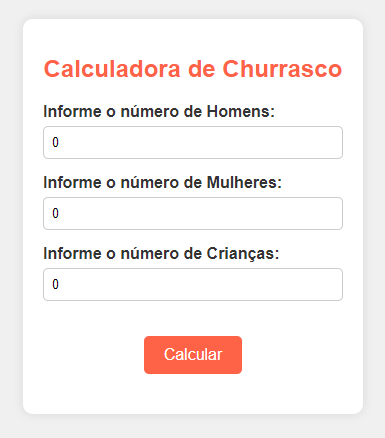
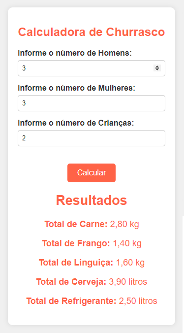

# Calculadora de Churrasco

Este projeto é uma calculadora de churrasco que ajuda a estimar a quantidade de carne, frango, linguiça, cerveja e refrigerante necessários para um churrasco, com base no número de homens, mulheres e crianças. A aplicação foi criada como atividade final para a cadeira de Front End do curso de ADS da Unicesumar.

## Funcionalidades

- **Cálculo de carnes e bebidas**: Calcula a quantidade necessária de cada item para o churrasco.
- **Interface amigável**: Interface simples e fácil de usar.

## Capturas de Tela

### Tela Inicial


### Resultado do Cálculo


## Como Usar

1. Clone este repositório:
    ```bash
    git clone https://github.com/seu-usuario/calculadora-de-churrasco.git
    ```

2. Navegue até o diretório do projeto:
    ```bash
    cd calculadora-de-churrasco
    ```

3. Abra o arquivo `index.html` no seu navegador.

## Estrutura do Projeto

- `index.html`: Contém a estrutura HTML da aplicação.
- `style.css`: Contém os estilos CSS para a aplicação.
- `script.js`: Contém a lógica JavaScript para o cálculo dos itens do churrasco.

## Tecnologias Utilizadas

- HTML
- CSS
- JavaScript
